<div align="center">

<picture>
  <source media="(prefers-color-scheme: dark)" srcset="assets/brand/banner-dark.png">
  <source media="(prefers-color-scheme: light)" srcset="assets/brand/banner-light.png">
  
</picture>

### One open prompt library, native in every AI tool. Free forever.

<!-- stats:start -->
<b>3,634</b> entries &nbsp;·&nbsp; <b>22</b> domains &nbsp;·&nbsp; <b>147</b> categories &nbsp;·&nbsp; <b>215</b> personas &nbsp;·&nbsp; <b>111</b> workflows
<!-- stats:end -->

Prompts, personas and workflows for work, learning, creativity and everyday life.<br>
Each one is written once and installs in your AI tool's own format with one line.

[](https://github.com/hermes-hq/hodios/stargazers)
[](https://github.com/hermes-hq/hodios/actions/workflows/check.yml)
[](https://github.com/hermes-hq/hodios/releases)
[](https://www.npmjs.com/package/@hermes-hq/hodios)
[](LICENSES/CC0-1.0.txt)
[](LICENSE)
[](https://buymeacoffee.com/anhaia)

[**Browse the library →**](https://hermes-ide.com/prompts) &nbsp;·&nbsp; [Try it in 10 seconds](#try-it-in-10-seconds) &nbsp;·&nbsp; [Where it stands](#where-it-stands) &nbsp;·&nbsp; [Suggest a prompt](https://github.com/hermes-hq/hodios/issues/new?template=new-prompt.yml) &nbsp;·&nbsp; [Contribute](CONTRIBUTING.md)

<sub>If Hodios saves you time, <a href="https://github.com/hermes-hq/hodios/stargazers">star the repo</a>. It is how other people find it.</sub>

</div>

---

<!-- tools:start -->
Works with **Claude Code** · **Codex** · **Cursor** · **GitHub Copilot** · **Gemini CLI** · **Antigravity** · **OpenCode** · **Windsurf** · **Zed** · **Continue** · **ChatGPT** · **claude.ai**.
<!-- tools:end -->

Anything else that reads Agent Skills or `AGENTS.md` works too. Coming soon as the built-in library of [Hermes IDE](https://hermes-ide.com) (the IDE, not Hermes Agent).

Every entry is written once and compiled to each tool's native format: Agent Skills, plugins, subagents, slash commands, rules files or plain paste-in text. Nothing to learn, nothing to run, no account, no API key.

<p align="center">
  
  <br><sub>Real output from the published CLI, recorded by <a href="tools/demo/record-cli.mjs"><code>tools/demo/record-cli.mjs</code></a>.</sub>
</p>

## Try it in 10 seconds

```sh
# Claude Code: a whole domain as one plugin
claude plugin marketplace add hermes-hq/hodios-dist
claude plugin install hodios-software-engineering@hodios

# Codex, Cursor, Copilot, OpenCode or any Agent Skills tool
npx skills add hermes-hq/hodios-dist --skill review-pull-request -a codex

# Search the whole catalog, ranked for the project you're in
npx @hermes-hq/hodios search
```

Using ChatGPT or claude.ai? Open any entry on [hermes-ide.com/prompts](https://hermes-ide.com/prompts), press Copy and paste it into a chat.

## Not just for code

A small taste. Every one of these is a single line to install.

| You want to… | Use |
|---|---|
| Get a pull request reviewed the way a careful senior engineer would | [`review-pull-request`](library/software-engineering/code-review/review-pull-request/) |
| Have a security subagent that only reports issues with a real attack path | [`security-auditor`](library/software-engineering/security/security-auditor/) |
| Find out whether an online shop is a scam before you pay | [`check-online-shop-legitimacy`](library/productivity/digital-safety/check-online-shop-legitimacy/) |
| Understand a scary error message and fix it safely | [`explain-error-message`](library/productivity/tech-help/explain-error-message/) |
| Ask for a raise with evidence, a number and a script | [`ask-for-raise`](library/career-hr/career-growth/ask-for-raise/) |
| Appeal a denied insurance claim against the policy wording | [`appeal-insurance-denial`](library/legal-admin/legal-correspondence/appeal-insurance-denial/) |
| Tell a child about a divorce, an illness or a death | [`explain-hard-topic-to-child`](library/parenting-family/parenting/explain-hard-topic-to-child/) |
| Plan a week of meals, with the shopping list grouped by aisle | [`plan-weekly-meals`](library/home-cooking/meal-planning/plan-weekly-meals/) |
| Build a training plan that progresses safely | [`build-training-plan`](library/health-wellbeing/fitness/build-training-plan/) |
| Budget a trip before you book it | [`plan-trip-budget`](library/travel/travel-logistics/plan-trip-budget/) |
| Compare a stack of papers for a literature review | [`build-literature-matrix`](library/research-science/literature-review/build-literature-matrix/) |
| Call an A/B test: ship, iterate or stop | [`analyze-ab-test-results`](library/data-analysis/statistics/analyze-ab-test-results/) |
| Balance a combat encounter for your tabletop party | [`balance-combat-encounter`](library/gaming-fun/tabletop-rpg/balance-combat-encounter/) |
| Rewrite a prompt for a reasoning model | [`adapt-prompt-for-reasoning-model`](library/prompting/prompt-engineering/adapt-prompt-for-reasoning-model/) |

[See every domain and category ↓](#whats-inside)

## What an entry looks like

One Markdown file with typed arguments, an explicit output contract and shared guardrails ([full file](library/software-engineering/code-review/review-pull-request/prompt.md)):

```markdown
---
id: review-pull-request
kind: prompt
title: Review a pull request
status: experimental
authorship: human
args:
  - {name: diff, type: text, required: true}
  - {name: focus, type: enum, enum: [correctness, security, performance, all], default: all}
output_contract: {format: markdown, sections: [Verdict, Findings, Missing tests]}
pairs_with: {personas: [code-reviewer, security-auditor]}
---
<task>
Review {{diff}}. If it is a PR URL or branch name, fetch the diff; if you cannot, ask for it once and stop.
1. Read the whole diff once before judging any hunk.
2. For each suspected defect, trace the input that triggers it. Drop it if you cannot construct one.
3. Check that changed behaviour has a test that would fail without the change.
</task>
```

Next to it sits an `evals.yaml`: realistic cases (here an off-by-one bug, an empty diff and a harmless comment fix) that set the entry against a plain one-line request, `Review this pull request: {{diff}}`, on models from two vendors, graded by a third. The compiler turns that one file into a Claude Code skill and slash command, a Codex skill, a Copilot prompt file, a Gemini command, a Cursor rule or paste-in text.

What the model gets, side by side:

| A plain request | The Hodios entry |
|---|---|
| `Review this pull request: <diff>` | Why the review matters and what a careful senior reviewer blocks on |
| | Three steps: read the whole diff, trace the input that triggers each defect, check for a test that would fail without the change |
| | Limits: at most 10 findings, no style comments, ask for anything missing instead of guessing |
| | A fixed output: Verdict, Findings as `path:line`, Missing tests |
| | One worked example of a good finding |

Run `npx @hermes-hq/hodios use review-pull-request` to see the full text your model receives.

## Why Hodios

- **Evals in the open.** Entries ship with eval cases that set them against a plain one-line request. An entry is marked stable only after it beats that request on models from two vendors, and every entry shows its status. [Where the library stands today ↓](#where-it-stands)
- **Native everywhere.** One source, compiled to each tool's real format and limits. No wrapper, no runtime, no lock-in.
- **The ones for you, not all of them.** Entries are tagged by stack, stage, needs and tool, so search puts what fits your project first.
- **Self-contained.** An installed entry never depends on another entry being installed.
- **Safe by construction.** Entries are text only: no scripts, no tool grants, no hidden characters, no download-and-run. Every change is linted and reviewed.
- **Free for any use.** Content is CC0: copy it into your repo, your product or your docs. A link back is appreciated, never required.
- **No telemetry in the library or the CLI.** They collect nothing. (The website, hermes-ide.com, uses analytics.)

## Install

Pick your tool. Each command was run against the published install tree in [hermes-hq/hodios-dist](https://github.com/hermes-hq/hodios-dist); swap the id or domain for any curated entry. The install tree holds the curated tier only (at most 2,000 entries, listed in [`curated.txt`](curated.txt)), because these installers download the whole repository. Every other entry installs with [the CLI](#use-the-cli).

| Tool | One line |
|---|---|
| **Claude Code** | `claude plugin marketplace add hermes-hq/hodios-dist && claude plugin install hodios-software-engineering@hodios` |
| **Codex, Cursor, Copilot, OpenCode and other Agent Skills tools** | `npx skills add hermes-hq/hodios-dist --skill review-pull-request -a codex` |
| **Gemini CLI** | `gemini skills install https://github.com/hermes-hq/hodios-dist --path skills/review-pull-request --consent` |
| **ChatGPT, claude.ai, anything else** | Copy `paste/<id>.md` from [hodios-dist](https://github.com/hermes-hq/hodios-dist/tree/main/paste), or run `npx @hermes-hq/hodios use <id>` for any entry |
| **Hermes IDE** | Coming soon: built in, in the Library tab. |

Claude Code installs a whole domain at a time: `hodios-software-engineering`, `hodios-education`, `hodios-travel` and so on, one plugin per domain. Then call an entry as `/hodios-software-engineering:review-pull-request`, or let Claude pick the subagents (`hodios-software-engineering:security-auditor`). For `npx skills`, `-a` takes `claude-code`, `codex`, `cursor`, `github-copilot`, `opencode`, `gemini-cli` and more; `--skill '*'` installs every curated entry.

### Use the CLI

The CLI searches the whole catalog, curated or not, ranks what fits your project and writes each tool's native files (rules and personas included, which the installers above do not cover). Run it with npx, or install it once to get the `hodios` command:

```sh
npx @hermes-hq/hodios install review-pull-request --target claude-code
npm install -g @hermes-hq/hodios                 # then use `hodios` directly

cd ~/my-project
hodios search                                    # what fits this project first, and why
hodios install review-pull-request python-style-rules --target cursor
hodios use review-pull-request --arg diff=@- < my-change.diff | claude -p
```

Targets: `claude-code`, `codex`, `cursor`, `copilot`, `gemini-cli`, `opencode`, `agents-md`, `paste`, `hermes` (Hermes IDE). `list` shows what is installed and `remove` takes it out again.

## Where it stands

Hodios is new, so here is exactly how far it has got. No eval results are published yet; they will be, entry by entry, as entries reach stable.

<!-- status:start -->
| Status | Entries | What it means |
|---|---:|---|
| Stable | 0 | Beat a plain one-line request on its own evals, on models from two vendors |
| Experimental | 139 | Has at least three eval cases (happy path, edge case, negative case); not yet promoted |
| Incubating | 3,495 | New; evals are optional at this stage |

- **3,629** of 3,634 entries ship with eval cases.
- Who wrote them: **2** by a person, **2,548** by a person with AI help, **1,084** drafted by AI.
- **1,996** entries are in the curated tier that the plugins and `npx skills` install. The CLI installs all 3,634.
<!-- status:end -->

The status and authorship of every entry are in its frontmatter. Every AI-assisted or AI-drafted entry names the contributor who reviewed it and signed it off, and every change goes through the same lint and review.

## What's inside

| Kind | What it is | Becomes |
|---|---|---|
| **Prompt** | A task with typed inputs: review a PR, find a root cause, write a migration | Skill, slash command, Copilot prompt file, Gemini command |
| **Persona** | Who the agent is and how it works: security auditor, debugger, tech writer | Subagent, output style, custom agent, project instructions |
| **Workflow** | Ordered steps with approval gates: feature track, literature review | Skill with the steps inlined, Copilot prompt file, Gemini command, Hermes Track |
| **Rule** | Always-on project instructions: TypeScript strictness, commit conventions | AGENTS.md / CLAUDE.md / GEMINI.md section, Cursor rule, Copilot instructions |
| **Style** | An output modifier with 5 levels: concise, diff-only, beginner-friendly | Output style or appended instructions |

Entries are organised by domain and category, from **code review**, **debugging** and **testing** to **teaching**, **trip planning** and **statistics**. The full list is below.

### The ones for you, not all of them

Every entry is tagged with what it is for: the **stack** it targets (TypeScript, Django, Terraform…), the **stage** of work (plan, build, review, operate…), what it **needs** (repo access, shell, an MCP server) and which **tools** it works in. Hermes IDE, the site and the CLI use those tags to put the entries that match your project and your interests first, so you see a short, relevant list instead of the whole catalog. Stack-agnostic entries stay visible to everyone.

In a project folder, `npx @hermes-hq/hodios search` with no query does this on your machine: it reads the project's manifests and agent config folders, ranks what fits first and says why ("your project uses React"). Nothing is sent anywhere, and `--all` turns it off.

<!-- catalog:start -->
**3634 entries** (3229 prompts, 215 personas, 111 workflows, 44 rules, 35 styles).

<details><summary><b>Software engineering</b> · 458</summary>

| Category | Entries | Try |
|---|---:|---|
| Implementation | 63 | [`add-feature-flag`](library/software-engineering/implementation/add-feature-flag/) · [`add-rate-limiting`](library/software-engineering/implementation/add-rate-limiting/) · [`add-retries-and-timeouts`](library/software-engineering/implementation/add-retries-and-timeouts/) |
| AI and ML engineering | 42 | [`add-llm-output-guardrails`](library/software-engineering/ai-ml/add-llm-output-guardrails/) · [`analyze-aspect-sentiment`](library/software-engineering/ai-ml/analyze-aspect-sentiment/) · [`answer-from-retrieved-context`](library/software-engineering/ai-ml/answer-from-retrieved-context/) |
| Learning to code | 29 | [`coach-coding-kata`](library/software-engineering/learning/coach-coding-kata/) · [`create-coding-exercises`](library/software-engineering/learning/create-coding-exercises/) · [`emulate-assembly-stepper`](library/software-engineering/learning/emulate-assembly-stepper/) |
| Security | 26 | [`audit-app-security`](library/software-engineering/security/audit-app-security/) · [`audit-compliance-controls`](library/software-engineering/security/audit-compliance-controls/) · [`audit-dependencies`](library/software-engineering/security/audit-dependencies/) |
| Security operations | 23 | [`analyze-email-headers`](library/software-engineering/security-operations/analyze-email-headers/) · [`analyze-packet-capture`](library/software-engineering/security-operations/analyze-packet-capture/) · [`analyze-suspicious-script`](library/software-engineering/security-operations/analyze-suspicious-script/) |
| Conventions | 21 | [`api-design-rules`](library/software-engineering/conventions/api-design-rules/) · [`csharp-style-rules`](library/software-engineering/conventions/csharp-style-rules/) · [`django-rules`](library/software-engineering/conventions/django-rules/) |
| DevOps | 20 | [`deploy-to-vps`](library/software-engineering/devops/deploy-to-vps/) · [`design-ci-cd-pipeline`](library/software-engineering/devops/design-ci-cd-pipeline/) · [`design-deployment-strategy`](library/software-engineering/devops/design-deployment-strategy/) |
| Debugging | 19 | [`bisect-regression`](library/software-engineering/debugging/bisect-regression/) · [`debug-mobile-crash`](library/software-engineering/debugging/debug-mobile-crash/) · [`debug-native-crash`](library/software-engineering/debugging/debug-native-crash/) |
| Testing | 19 | [`add-characterization-tests`](library/software-engineering/testing/add-characterization-tests/) · [`add-regression-test`](library/software-engineering/testing/add-regression-test/) · [`fill-test-gaps`](library/software-engineering/testing/fill-test-gaps/) |
| Architecture | 18 | [`compare-design-options`](library/software-engineering/architecture/compare-design-options/) · [`design-api-contract`](library/software-engineering/architecture/design-api-contract/) · [`design-event-driven-system`](library/software-engineering/architecture/design-event-driven-system/) |
| Data engineering | 17 | [`convert-notebook-to-pipeline`](library/software-engineering/data/convert-notebook-to-pipeline/) · [`design-data-pipeline`](library/software-engineering/data/design-data-pipeline/) · [`design-database-schema`](library/software-engineering/data/design-database-schema/) |
| Documentation | 17 | [`audit-documentation`](library/software-engineering/docs/audit-documentation/) · [`audit-readme-conversion`](library/software-engineering/docs/audit-readme-conversion/) · [`document-public-api`](library/software-engineering/docs/document-public-api/) |
| Incident and operations | 17 | [`build-incident-timeline`](library/software-engineering/incident/build-incident-timeline/) · [`collect-incident-evidence`](library/software-engineering/incident/collect-incident-evidence/) · [`define-slos`](library/software-engineering/incident/define-slos/) |
| Refactoring | 16 | [`apply-design-pattern`](library/software-engineering/refactoring/apply-design-pattern/) · [`convert-callbacks-to-async-await`](library/software-engineering/refactoring/convert-callbacks-to-async-await/) · [`decouple-for-testability`](library/software-engineering/refactoring/decouple-for-testability/) |
| Migration | 14 | [`migrate-api-version`](library/software-engineering/migration/migrate-api-version/) · [`migrate-auth-provider`](library/software-engineering/migration/migrate-auth-provider/) · [`migrate-ci-provider`](library/software-engineering/migration/migrate-ci-provider/) |
| Planning | 14 | [`assess-technical-debt`](library/software-engineering/planning/assess-technical-debt/) · [`audit-contributor-funnel`](library/software-engineering/planning/audit-contributor-funnel/) · [`break-down-epic`](library/software-engineering/planning/break-down-epic/) |
| Git and version control | 13 | [`choose-branching-strategy`](library/software-engineering/git/choose-branching-strategy/) · [`clean-up-commit-history`](library/software-engineering/git/clean-up-commit-history/) · [`investigate-code-history`](library/software-engineering/git/investigate-code-history/) |
| Accessibility | 12 | [`audit-mobile-accessibility`](library/software-engineering/accessibility/audit-mobile-accessibility/) · [`audit-web-accessibility`](library/software-engineering/accessibility/audit-web-accessibility/) · [`build-aria-widget`](library/software-engineering/accessibility/build-aria-widget/) |
| Code review | 12 | [`play-code-review-bug-hunt`](library/software-engineering/code-review/play-code-review-bug-hunt/) · [`reply-to-first-contribution`](library/software-engineering/code-review/reply-to-first-contribution/) · [`respond-to-review-comments`](library/software-engineering/code-review/respond-to-review-comments/) |
| Performance | 12 | [`find-memory-leak`](library/software-engineering/performance/find-memory-leak/) · [`fix-n-plus-one-queries`](library/software-engineering/performance/fix-n-plus-one-queries/) · [`fix-react-rerenders`](library/software-engineering/performance/fix-react-rerenders/) |
| Developer writing | 10 | [`explain-tech-to-executives`](library/software-engineering/writing/explain-tech-to-executives/) · [`rewrite-for-clarity`](library/software-engineering/writing/rewrite-for-clarity/) · [`write-api-deprecation-notice`](library/software-engineering/writing/write-api-deprecation-notice/) |
| Localization (software) | 9 | [`build-localization-glossary`](library/software-engineering/localization/build-localization-glossary/) · [`extract-ui-strings`](library/software-engineering/localization/extract-ui-strings/) · [`implement-locale-formatting`](library/software-engineering/localization/implement-locale-formatting/) |
| Coding-agent operations | 9 | [`audit-agent-permissions`](library/software-engineering/meta/audit-agent-permissions/) · [`manage-agent-context-for-long-task`](library/software-engineering/meta/manage-agent-context-for-long-task/) · [`plan-coding-agent-rollout`](library/software-engineering/meta/plan-coding-agent-rollout/) |
| Product (engineering) | 6 | [`define-non-functional-requirements`](library/software-engineering/product/define-non-functional-requirements/) · [`refine-backlog-ticket`](library/software-engineering/product/refine-backlog-ticket/) · [`write-acceptance-criteria`](library/software-engineering/product/write-acceptance-criteria/) |

</details>

<details><summary><b>Learning and education</b> · 235</summary>

| Category | Entries | Try |
|---|---:|---|
| Teaching | 83 | [`adapt-text-reading-level`](library/education/teaching/adapt-text-reading-level/) · [`align-lesson-to-standards`](library/education/teaching/align-lesson-to-standards/) · [`analyze-class-assessment-results`](library/education/teaching/analyze-class-assessment-results/) |
| Tutoring | 47 | [`analyze-literary-work`](library/education/tutoring/analyze-literary-work/) · [`analyze-primary-source`](library/education/tutoring/analyze-primary-source/) · [`check-my-reasoning`](library/education/tutoring/check-my-reasoning/) |
| Exam preparation | 42 | [`analyze-past-papers`](library/education/exam-prep/analyze-past-papers/) · [`coach-enem-essay`](library/education/exam-prep/coach-enem-essay/) · [`coach-gaokao-essay`](library/education/exam-prep/coach-gaokao-essay/) |
| Course design | 32 | [`build-course-reading-list`](library/education/course-design/build-course-reading-list/) · [`build-self-study-curriculum`](library/education/course-design/build-self-study-curriculum/) · [`convert-course-to-online`](library/education/course-design/convert-course-to-online/) |
| Studying | 31 | [`adapt-study-for-learning-difference`](library/education/studying/adapt-study-for-learning-difference/) · [`analyze-exam-mistakes`](library/education/studying/analyze-exam-mistakes/) · [`build-concept-map`](library/education/studying/build-concept-map/) |

</details>

<details><summary><b>Languages</b> · 107</summary>

| Category | Entries | Try |
|---|---:|---|
| Language learning | 60 | [`adapt-language-learning-for-dyslexia`](library/languages/language-learning/adapt-language-learning-for-dyslexia/) · [`assess-language-level`](library/languages/language-learning/assess-language-level/) · [`build-personal-phrasebook`](library/languages/language-learning/build-personal-phrasebook/) |
| Translation | 26 | [`adapt-regional-variant`](library/languages/translation/adapt-regional-variant/) · [`adapt-script-for-dubbing`](library/languages/translation/adapt-script-for-dubbing/) · [`back-translate-to-verify`](library/languages/translation/back-translate-to-verify/) |
| Conversation practice | 21 | [`describe-pictures-in-language`](library/languages/conversation-practice/describe-pictures-in-language/) · [`discuss-article-in-language`](library/languages/conversation-practice/discuss-article-in-language/) · [`practice-interview-in-language`](library/languages/conversation-practice/practice-interview-in-language/) |

</details>

<details><summary><b>Content creation</b> · 155</summary>

| Category | Entries | Try |
|---|---:|---|
| Social media | 37 | [`brainstorm-brand-memes`](library/content-creation/social-media/brainstorm-brand-memes/) · [`build-creator-rate-card`](library/content-creation/social-media/build-creator-rate-card/) · [`choose-community-channels`](library/content-creation/social-media/choose-community-channels/) |
| Blogging | 32 | [`edit-transcript-into-article`](library/content-creation/blogging/edit-transcript-into-article/) · [`generate-blog-post-ideas`](library/content-creation/blogging/generate-blog-post-ideas/) · [`pitch-freelance-article`](library/content-creation/blogging/pitch-freelance-article/) |
| Video | 32 | [`adapt-script-for-teleprompter`](library/content-creation/video/adapt-script-for-teleprompter/) · [`adapt-trend-format`](library/content-creation/video/adapt-trend-format/) · [`analyze-video-retention`](library/content-creation/video/analyze-video-retention/) |
| Podcasting | 22 | [`choose-podcast-setup`](library/content-creation/podcasting/choose-podcast-setup/) · [`create-podcast-edit-list`](library/content-creation/podcasting/create-podcast-edit-list/) · [`launch-podcast`](library/content-creation/podcasting/launch-podcast/) |
| Content strategy | 17 | [`analyze-competitor-channels`](library/content-creation/content-strategy/analyze-competitor-channels/) · [`analyze-content-performance`](library/content-creation/content-strategy/analyze-content-performance/) · [`audit-content-library`](library/content-creation/content-strategy/audit-content-library/) |
| Newsletters | 15 | [`audit-newsletter-performance`](library/content-creation/newsletters/audit-newsletter-performance/) · [`curate-link-roundup`](library/content-creation/newsletters/curate-link-roundup/) · [`grow-newsletter`](library/content-creation/newsletters/grow-newsletter/) |

</details>

<details><summary><b>Marketing and sales</b> · 165</summary>

| Category | Entries | Try |
|---|---:|---|
| Copywriting | 43 | [`analyze-competitor-copy`](library/marketing-sales/copywriting/analyze-competitor-copy/) · [`critique-marketing-copy`](library/marketing-sales/copywriting/critique-marketing-copy/) · [`plan-promotional-offer`](library/marketing-sales/copywriting/plan-promotional-offer/) |
| Sales | 39 | [`ask-clients-for-referrals`](library/marketing-sales/sales/ask-clients-for-referrals/) · [`build-sales-playbook`](library/marketing-sales/sales/build-sales-playbook/) · [`follow-up-event-leads`](library/marketing-sales/sales/follow-up-event-leads/) |
| Marketing strategy | 33 | [`analyze-competitors`](library/marketing-sales/marketing-strategy/analyze-competitors/) · [`brainstorm-guerrilla-marketing`](library/marketing-sales/marketing-strategy/brainstorm-guerrilla-marketing/) · [`build-annual-marketing-calendar`](library/marketing-sales/marketing-strategy/build-annual-marketing-calendar/) |
| SEO | 21 | [`analyze-search-console-data`](library/marketing-sales/seo/analyze-search-console-data/) · [`audit-docs-seo`](library/marketing-sales/seo/audit-docs-seo/) · [`audit-on-page-seo`](library/marketing-sales/seo/audit-on-page-seo/) |
| Advertising | 15 | [`analyze-ad-performance`](library/marketing-sales/advertising/analyze-ad-performance/) · [`audit-search-ads-account`](library/marketing-sales/advertising/audit-search-ads-account/) · [`check-ad-policy-compliance`](library/marketing-sales/advertising/check-ad-policy-compliance/) |
| Email marketing | 14 | [`audit-email-deliverability`](library/marketing-sales/email-marketing/audit-email-deliverability/) · [`design-email-template`](library/marketing-sales/email-marketing/design-email-template/) · [`plan-email-segmentation`](library/marketing-sales/email-marketing/plan-email-segmentation/) |

</details>

<details><summary><b>Product management</b> · 103</summary>

| Category | Entries | Try |
|---|---:|---|
| Product strategy | 22 | [`assess-product-market-fit`](library/product-management/product-strategy/assess-product-market-fit/) · [`define-mvp-scope`](library/product-management/product-strategy/define-mvp-scope/) · [`design-free-tier`](library/product-management/product-strategy/design-free-tier/) |
| Product discovery | 18 | [`analyze-competitor-reviews`](library/product-management/product-discovery/analyze-competitor-reviews/) · [`define-jobs-to-be-done`](library/product-management/product-discovery/define-jobs-to-be-done/) · [`design-validation-experiment`](library/product-management/product-discovery/design-validation-experiment/) |
| Product launch | 18 | [`define-launch-tiers`](library/product-management/product-launch/define-launch-tiers/) · [`plan-feature-adoption-push`](library/product-management/product-launch/plan-feature-adoption-push/) · [`plan-launch-retrospective`](library/product-management/product-launch/plan-launch-retrospective/) |
| Product metrics | 18 | [`analyze-conversion-funnel`](library/product-management/product-metrics/analyze-conversion-funnel/) · [`build-experiment-backlog`](library/product-management/product-metrics/build-experiment-backlog/) · [`choose-marketplace-metrics`](library/product-management/product-metrics/choose-marketplace-metrics/) |
| User feedback | 14 | [`analyze-cancellation-feedback`](library/product-management/user-feedback/analyze-cancellation-feedback/) · [`analyze-site-search-for-demand`](library/product-management/user-feedback/analyze-site-search-for-demand/) · [`analyze-user-feedback`](library/product-management/user-feedback/analyze-user-feedback/) |
| Roadmapping | 13 | [`build-outcome-roadmap`](library/product-management/roadmapping/build-outcome-roadmap/) · [`build-user-story-map`](library/product-management/roadmapping/build-user-story-map/) · [`decline-feature-request`](library/product-management/roadmapping/decline-feature-request/) |

</details>

<details><summary><b>Business and strategy</b> · 171</summary>

| Category | Entries | Try |
|---|---:|---|
| Operations | 63 | [`automate-business-workflow`](library/business/operations/automate-business-workflow/) · [`build-allergen-matrix`](library/business/operations/build-allergen-matrix/) · [`build-commercial-cleaning-rota`](library/business/operations/build-commercial-cleaning-rota/) |
| Customer support | 29 | [`analyze-support-tickets`](library/business/customer-support/analyze-support-tickets/) · [`build-service-recovery-playbook`](library/business/customer-support/build-service-recovery-playbook/) · [`build-support-macros`](library/business/customer-support/build-support-macros/) |
| Fundraising | 29 | [`build-investor-pipeline`](library/business/fundraising/build-investor-pipeline/) · [`choose-oss-funding-model`](library/business/fundraising/choose-oss-funding-model/) · [`explain-term-sheet`](library/business/fundraising/explain-term-sheet/) |
| Entrepreneurship | 26 | [`evaluate-buying-a-business`](library/business/entrepreneurship/evaluate-buying-a-business/) · [`evaluate-pivot`](library/business/entrepreneurship/evaluate-pivot/) · [`find-cofounder`](library/business/entrepreneurship/find-cofounder/) |
| Business strategy | 24 | [`analyze-business-model`](library/business/business-strategy/analyze-business-model/) · [`assess-competitive-advantage`](library/business/business-strategy/assess-competitive-advantage/) · [`build-annual-operating-plan`](library/business/business-strategy/build-annual-operating-plan/) |

</details>

<details><summary><b>Data analysis</b> · 154</summary>

| Category | Entries | Try |
|---|---:|---|
| Data exploration | 49 | [`analyze-contact-centre-data`](library/data-analysis/data-exploration/analyze-contact-centre-data/) · [`analyze-discount-effectiveness`](library/data-analysis/data-exploration/analyze-discount-effectiveness/) · [`analyze-donor-data`](library/data-analysis/data-exploration/analyze-donor-data/) |
| Spreadsheets | 33 | [`audit-spreadsheet-model`](library/data-analysis/spreadsheets/audit-spreadsheet-model/) · [`build-amortization-schedule`](library/data-analysis/spreadsheets/build-amortization-schedule/) · [`build-commission-calculator`](library/data-analysis/spreadsheets/build-commission-calculator/) |
| Statistics | 30 | [`analyze-ab-test-results`](library/data-analysis/statistics/analyze-ab-test-results/) · [`analyze-likert-data`](library/data-analysis/statistics/analyze-likert-data/) · [`build-composite-index`](library/data-analysis/statistics/build-composite-index/) |
| Reporting | 22 | [`automate-recurring-report`](library/data-analysis/reporting/automate-recurring-report/) · [`build-kpi-tree`](library/data-analysis/reporting/build-kpi-tree/) · [`build-metrics-glossary`](library/data-analysis/reporting/build-metrics-glossary/) |
| Data visualisation | 20 | [`audit-dashboard`](library/data-analysis/data-visualization/audit-dashboard/) · [`build-dashboard-from-csv`](library/data-analysis/data-visualization/build-dashboard-from-csv/) · [`build-looker-studio-report`](library/data-analysis/data-visualization/build-looker-studio-report/) |

</details>

<details><summary><b>Research and science</b> · 117</summary>

| Category | Entries | Try |
|---|---:|---|
| Research methods | 32 | [`agree-authorship-order`](library/research-science/research-methods/agree-authorship-order/) · [`build-qualitative-codebook`](library/research-science/research-methods/build-qualitative-codebook/) · [`calculate-solution-dilutions`](library/research-science/research-methods/calculate-solution-dilutions/) |
| Scientific writing | 29 | [`appeal-journal-rejection`](library/research-science/scientific-writing/appeal-journal-rejection/) · [`choose-target-journal`](library/research-science/scientific-writing/choose-target-journal/) · [`design-research-poster`](library/research-science/scientific-writing/design-research-poster/) |
| Fact-checking | 23 | [`analyze-spin-in-article`](library/research-science/fact-checking/analyze-spin-in-article/) · [`audit-ai-answer-for-errors`](library/research-science/fact-checking/audit-ai-answer-for-errors/) · [`audit-argument-evidence`](library/research-science/fact-checking/audit-argument-evidence/) |
| Literature review | 20 | [`appraise-study-quality`](library/research-science/literature-review/appraise-study-quality/) · [`build-literature-matrix`](library/research-science/literature-review/build-literature-matrix/) · [`build-search-string`](library/research-science/literature-review/build-search-string/) |
| Peer review | 13 | [`assess-reproducibility`](library/research-science/peer-review/assess-reproducibility/) · [`check-journal-legitimacy`](library/research-science/peer-review/check-journal-legitimacy/) · [`check-manuscript-reporting`](library/research-science/peer-review/check-manuscript-reporting/) |

</details>

<details><summary><b>Design</b> · 108</summary>

| Category | Entries | Try |
|---|---:|---|
| UI design | 32 | [`adapt-design-for-mobile`](library/design/ui-design/adapt-design-for-mobile/) · [`adapt-ui-for-older-adults`](library/design/ui-design/adapt-ui-for-older-adults/) · [`check-ui-against-platform-conventions`](library/design/ui-design/check-ui-against-platform-conventions/) |
| UX research | 24 | [`analyze-session-recordings`](library/design/ux-research/analyze-session-recordings/) · [`build-empathy-map`](library/design/ux-research/build-empathy-map/) · [`build-research-repository`](library/design/ux-research/build-research-repository/) |
| Graphic design | 23 | [`create-color-palette`](library/design/graphic-design/create-color-palette/) · [`create-mood-board`](library/design/graphic-design/create-mood-board/) · [`critique-graphic-design`](library/design/graphic-design/critique-graphic-design/) |
| Branding | 16 | [`build-brand-guidelines`](library/design/branding/build-brand-guidelines/) · [`build-brand-platform`](library/design/branding/build-brand-platform/) · [`build-diy-brand-kit`](library/design/branding/build-diy-brand-kit/) |
| Design systems | 13 | [`audit-component-duplication`](library/design/design-systems/audit-component-duplication/) · [`audit-design-consistency`](library/design/design-systems/audit-design-consistency/) · [`audit-hardcoded-styles-against-tokens`](library/design/design-systems/audit-hardcoded-styles-against-tokens/) |

</details>

<details><summary><b>Creative arts</b> · 192</summary>

| Category | Entries | Try |
|---|---:|---|
| Fiction | 32 | [`build-suspense-in-scene`](library/creative-arts/fiction/build-suspense-in-scene/) · [`check-story-continuity`](library/creative-arts/fiction/check-story-continuity/) · [`co-write-story-interactively`](library/creative-arts/fiction/co-write-story-interactively/) |
| Image generation | 32 | [`build-image-style-guide`](library/creative-arts/image-generation/build-image-style-guide/) · [`coach-image-prompting`](library/creative-arts/image-generation/coach-image-prompting/) · [`create-storyboard`](library/creative-arts/image-generation/create-storyboard/) |
| Music | 24 | [`analyze-song-structure`](library/creative-arts/music/analyze-song-structure/) · [`build-music-sound-kit`](library/creative-arts/music/build-music-sound-kit/) · [`explain-music-theory-concept`](library/creative-arts/music/explain-music-theory-concept/) |
| Screenwriting | 15 | [`adapt-story-for-screen`](library/creative-arts/screenwriting/adapt-story-for-screen/) · [`develop-tv-series-concept`](library/creative-arts/screenwriting/develop-tv-series-concept/) · [`format-screenplay-scene`](library/creative-arts/screenwriting/format-screenplay-scene/) |
| Life writing | 14 | [`draft-memoir-scene`](library/creative-arts/life-writing/draft-memoir-scene/) · [`interview-relative-for-oral-history`](library/creative-arts/life-writing/interview-relative-for-oral-history/) · [`mine-memories-for-life-story`](library/creative-arts/life-writing/mine-memories-for-life-story/) |
| Photography | 14 | [`choose-camera-gear`](library/creative-arts/photography/choose-camera-gear/) · [`choose-camera-settings`](library/creative-arts/photography/choose-camera-settings/) · [`critique-photograph`](library/creative-arts/photography/critique-photograph/) |
| Poetry | 14 | [`analyze-poem`](library/creative-arts/poetry/analyze-poem/) · [`critique-poem`](library/creative-arts/poetry/critique-poem/) · [`generate-poetry-prompts`](library/creative-arts/poetry/generate-poetry-prompts/) |
| Video generation | 13 | [`convert-article-to-video-scenes`](library/creative-arts/video-generation/convert-article-to-video-scenes/) · [`fix-video-generation-drift`](library/creative-arts/video-generation/fix-video-generation-drift/) · [`plan-ai-presenter-video`](library/creative-arts/video-generation/plan-ai-presenter-video/) |
| Visual art | 13 | [`choose-art-supplies`](library/creative-arts/visual-art/choose-art-supplies/) · [`critique-artwork`](library/creative-arts/visual-art/critique-artwork/) · [`generate-sketchbook-prompts`](library/creative-arts/visual-art/generate-sketchbook-prompts/) |
| Worldbuilding | 13 | [`build-magic-system`](library/creative-arts/worldbuilding/build-magic-system/) · [`build-series-bible`](library/creative-arts/worldbuilding/build-series-bible/) · [`build-world-timeline`](library/creative-arts/worldbuilding/build-world-timeline/) |
| Nonfiction books | 8 | [`build-book-index`](library/creative-arts/nonfiction/build-book-index/) · [`draft-nonfiction-chapter`](library/creative-arts/nonfiction/draft-nonfiction-chapter/) · [`outline-nonfiction-book`](library/creative-arts/nonfiction/outline-nonfiction-book/) |

</details>

<details><summary><b>Writing and communication</b> · 193</summary>

| Category | Entries | Try |
|---|---:|---|
| Interpersonal communication | 47 | [`adapt-message-for-culture`](library/writing-communication/interpersonal-communication/adapt-message-for-culture/) · [`apologize-effectively`](library/writing-communication/interpersonal-communication/apologize-effectively/) · [`ask-for-a-favor`](library/writing-communication/interpersonal-communication/ask-for-a-favor/) |
| Email | 38 | [`ask-for-feedback-by-email`](library/writing-communication/email/ask-for-feedback-by-email/) · [`build-email-templates`](library/writing-communication/email/build-email-templates/) · [`correct-email-mistake`](library/writing-communication/email/correct-email-mistake/) |
| Business writing | 37 | [`ask-for-help-in-team-chat`](library/writing-communication/business-writing/ask-for-help-in-team-chat/) · [`plan-change-communications`](library/writing-communication/business-writing/plan-change-communications/) · [`write-annual-report-letter`](library/writing-communication/business-writing/write-annual-report-letter/) |
| Editing | 32 | [`build-self-editing-checklist`](library/writing-communication/editing/build-self-editing-checklist/) · [`build-style-sheet`](library/writing-communication/editing/build-style-sheet/) · [`capture-writing-voice`](library/writing-communication/editing/capture-writing-voice/) |
| Public speaking | 24 | [`craft-personal-story`](library/writing-communication/public-speaking/craft-personal-story/) · [`critique-speech-recording`](library/writing-communication/public-speaking/critique-speech-recording/) · [`develop-idea-talk`](library/writing-communication/public-speaking/develop-idea-talk/) |
| Presentations | 15 | [`convert-slides-to-handout`](library/writing-communication/presentations/convert-slides-to-handout/) · [`critique-slide-deck`](library/writing-communication/presentations/critique-slide-deck/) · [`drill-presentation-qa`](library/writing-communication/presentations/drill-presentation-qa/) |

</details>

<details><summary><b>Career and HR</b> · 164</summary>

| Category | Entries | Try |
|---|---:|---|
| Career growth | 36 | [`ask-for-raise`](library/career-hr/career-growth/ask-for-raise/) · [`assess-ai-impact-on-my-job`](library/career-hr/career-growth/assess-ai-impact-on-my-job/) · [`build-development-plan`](library/career-hr/career-growth/build-development-plan/) |
| Job search | 36 | [`accept-job-offer-in-writing`](library/career-hr/job-search/accept-job-offer-in-writing/) · [`address-selection-criteria`](library/career-hr/job-search/address-selection-criteria/) · [`analyze-job-posting`](library/career-hr/job-search/analyze-job-posting/) |
| People management | 30 | [`address-underperformance-early`](library/career-hr/people-management/address-underperformance-early/) · [`allocate-merit-increases`](library/career-hr/people-management/allocate-merit-increases/) · [`build-career-ladder`](library/career-hr/people-management/build-career-ladder/) |
| Interview preparation | 26 | [`answer-salary-expectations`](library/career-hr/interview-prep/answer-salary-expectations/) · [`debrief-interview`](library/career-hr/interview-prep/debrief-interview/) · [`drill-star-answers`](library/career-hr/interview-prep/drill-star-answers/) |
| Hiring | 20 | [`design-interview-loop`](library/career-hr/hiring/design-interview-loop/) · [`design-work-trial-shift`](library/career-hr/hiring/design-work-trial-shift/) · [`plan-first-hire`](library/career-hr/hiring/plan-first-hire/) |
| Résumés | 16 | [`check-resume-ats-readiness`](library/career-hr/resumes/check-resume-ats-readiness/) · [`convert-cv-to-country-format`](library/career-hr/resumes/convert-cv-to-country-format/) · [`optimize-linkedin-profile`](library/career-hr/resumes/optimize-linkedin-profile/) |

</details>

<details><summary><b>Finance</b> · 141</summary>

| Category | Entries | Try |
|---|---:|---|
| Taxes | 37 | [`check-730-precompilato`](library/finance/taxes/check-730-precompilato/) · [`check-sales-tax-obligations`](library/finance/taxes/check-sales-tax-obligations/) · [`check-tax-withholding`](library/finance/taxes/check-tax-withholding/) |
| Financial planning | 36 | [`build-credit-history-from-zero`](library/finance/financial-planning/build-credit-history-from-zero/) · [`build-net-worth-statement`](library/finance/financial-planning/build-net-worth-statement/) · [`compare-loan-offers`](library/finance/financial-planning/compare-loan-offers/) |
| Accounting | 30 | [`analyze-customer-profitability`](library/finance/accounting/analyze-customer-profitability/) · [`analyze-working-capital`](library/finance/accounting/analyze-working-capital/) · [`build-small-business-budget`](library/finance/accounting/build-small-business-budget/) |
| Budgeting | 20 | [`budget-for-holidays-and-gifts`](library/finance/budgeting/budget-for-holidays-and-gifts/) · [`budget-for-university`](library/finance/budgeting/budget-for-university/) · [`budget-irregular-income`](library/finance/budgeting/budget-irregular-income/) |
| Investing (education) | 18 | [`analyze-rental-property`](library/finance/investing/analyze-rental-property/) · [`check-portfolio-diversification`](library/finance/investing/check-portfolio-diversification/) · [`choose-financial-advisor`](library/finance/investing/choose-financial-advisor/) |

</details>

<details><summary><b>Legal and admin</b> · 146</summary>

| Category | Entries | Try |
|---|---:|---|
| Paperwork | 38 | [`apply-for-housing-assistance`](library/legal-admin/paperwork/apply-for-housing-assistance/) · [`apply-for-trademark`](library/legal-admin/paperwork/apply-for-trademark/) · [`calculate-clt-severance`](library/legal-admin/paperwork/calculate-clt-severance/) |
| Legal correspondence | 30 | [`appeal-benefits-decision`](library/legal-admin/legal-correspondence/appeal-benefits-decision/) · [`appeal-insurance-denial`](library/legal-admin/legal-correspondence/appeal-insurance-denial/) · [`appeal-parking-ticket`](library/legal-admin/legal-correspondence/appeal-parking-ticket/) |
| Contracts | 24 | [`build-contract-obligations-register`](library/legal-admin/contracts/build-contract-obligations-register/) · [`check-jeonse-contract`](library/legal-admin/contracts/check-jeonse-contract/) · [`choose-software-license`](library/legal-admin/contracts/choose-software-license/) |
| Legal practice | 23 | [`brief-court-case`](library/legal-admin/legal-practice/brief-court-case/) · [`build-damages-schedule`](library/legal-admin/legal-practice/build-damages-schedule/) · [`build-law-course-outline`](library/legal-admin/legal-practice/build-law-course-outline/) |
| Compliance | 16 | [`answer-security-questionnaire`](library/legal-admin/compliance/answer-security-questionnaire/) · [`assess-ai-act-obligations`](library/legal-admin/compliance/assess-ai-act-obligations/) · [`audit-data-protection-compliance`](library/legal-admin/compliance/audit-data-protection-compliance/) |
| Policies and terms | 15 | [`write-accessibility-statement`](library/legal-admin/policies/write-accessibility-statement/) · [`write-ai-use-policy`](library/legal-admin/policies/write-ai-use-policy/) · [`write-conflict-of-interest-policy`](library/legal-admin/policies/write-conflict-of-interest-policy/) |

</details>

<details><summary><b>Health and wellbeing</b> · 207</summary>

| Category | Entries | Try |
|---|---:|---|
| Mental health | 50 | [`bounce-back-from-rejection`](library/health-wellbeing/mental-health/bounce-back-from-rejection/) · [`build-connection-plan`](library/health-wellbeing/mental-health/build-connection-plan/) · [`build-coping-plan`](library/health-wellbeing/mental-health/build-coping-plan/) |
| Clinical practice | 47 | [`draft-discharge-summary`](library/health-wellbeing/clinical-practice/draft-discharge-summary/) · [`plan-advance-care-planning-conversation`](library/health-wellbeing/clinical-practice/plan-advance-care-planning-conversation/) · [`plan-breaking-bad-news`](library/health-wellbeing/clinical-practice/plan-breaking-bad-news/) |
| Medical visit preparation | 44 | [`access-healthcare-abroad`](library/health-wellbeing/medical-prep/access-healthcare-abroad/) · [`build-medication-list`](library/health-wellbeing/medical-prep/build-medication-list/) · [`build-symptom-log`](library/health-wellbeing/medical-prep/build-symptom-log/) |
| Fitness | 43 | [`adapt-exercise-for-condition`](library/health-wellbeing/fitness/adapt-exercise-for-condition/) · [`assess-fitness-baseline`](library/health-wellbeing/fitness/assess-fitness-baseline/) · [`build-training-plan`](library/health-wellbeing/fitness/build-training-plan/) |
| Nutrition | 23 | [`analyze-diet-log`](library/health-wellbeing/nutrition/analyze-diet-log/) · [`compare-diet-approaches`](library/health-wellbeing/nutrition/compare-diet-approaches/) · [`evaluate-supplement`](library/health-wellbeing/nutrition/evaluate-supplement/) |

</details>

<details><summary><b>Cooking and home</b> · 151</summary>

| Category | Entries | Try |
|---|---:|---|
| Home improvement | 36 | [`assemble-flat-pack-furniture`](library/home-cooking/home-improvement/assemble-flat-pack-furniture/) · [`build-home-inventory`](library/home-cooking/home-improvement/build-home-inventory/) · [`build-house-viewing-checklist`](library/home-cooking/home-improvement/build-house-viewing-checklist/) |
| Cooking | 33 | [`adapt-recipe`](library/home-cooking/cooking/adapt-recipe/) · [`adjust-recipe-for-altitude`](library/home-cooking/cooking/adjust-recipe-for-altitude/) · [`brew-tea-properly`](library/home-cooking/cooking/brew-tea-properly/) |
| Meal planning | 21 | [`build-grocery-list-from-recipes`](library/home-cooking/meal-planning/build-grocery-list-from-recipes/) · [`organise-potluck`](library/home-cooking/meal-planning/organise-potluck/) · [`plan-budget-meals`](library/home-cooking/meal-planning/plan-budget-meals/) |
| Pet care | 21 | [`build-pet-emergency-plan`](library/home-cooking/pet-care/build-pet-emergency-plan/) · [`care-for-backyard-chickens`](library/home-cooking/pet-care/care-for-backyard-chickens/) · [`care-for-senior-pet`](library/home-cooking/pet-care/care-for-senior-pet/) |
| Gardening | 20 | [`build-garden-calendar`](library/home-cooking/gardening/build-garden-calendar/) · [`build-raised-bed-plan`](library/home-cooking/gardening/build-raised-bed-plan/) · [`design-garden-border`](library/home-cooking/gardening/design-garden-border/) |
| Vehicles | 20 | [`change-flat-tyre`](library/home-cooking/vehicles/change-flat-tyre/) · [`check-car-before-road-trip`](library/home-cooking/vehicles/check-car-before-road-trip/) · [`choose-bike`](library/home-cooking/vehicles/choose-bike/) |

</details>

<details><summary><b>Travel</b> · 71</summary>

| Category | Entries | Try |
|---|---:|---|
| Trip planning | 32 | [`choose-accommodation`](library/travel/trip-planning/choose-accommodation/) · [`choose-destination`](library/travel/trip-planning/choose-destination/) · [`choose-ethical-volunteer-trip`](library/travel/trip-planning/choose-ethical-volunteer-trip/) |
| Travel logistics | 26 | [`beat-jet-lag`](library/travel/travel-logistics/beat-jet-lag/) · [`build-packing-list`](library/travel/travel-logistics/build-packing-list/) · [`check-destination-safety`](library/travel/travel-logistics/check-destination-safety/) |
| Local culture | 13 | [`check-local-festivals-and-holidays`](library/travel/local-culture/check-local-festivals-and-holidays/) · [`decode-foreign-menu`](library/travel/local-culture/decode-foreign-menu/) · [`guide-me-around-the-city`](library/travel/local-culture/guide-me-around-the-city/) |

</details>

<details><summary><b>Parenting and family</b> · 97</summary>

| Category | Entries | Try |
|---|---:|---|
| Parenting | 38 | [`build-reading-routine-with-child`](library/parenting-family/parenting/build-reading-routine-with-child/) · [`choose-childcare`](library/parenting-family/parenting/choose-childcare/) · [`choose-extracurricular-activities`](library/parenting-family/parenting/choose-extracurricular-activities/) |
| Kids' activities | 21 | [`create-kids-craft`](library/parenting-family/kids-activities/create-kids-craft/) · [`create-puppet-show`](library/parenting-family/kids-activities/create-puppet-show/) · [`design-kids-science-experiment`](library/parenting-family/kids-activities/design-kids-science-experiment/) |
| Family logistics | 19 | [`build-care-rota`](library/parenting-family/family-logistics/build-care-rota/) · [`coordinate-family-calendar`](library/parenting-family/family-logistics/coordinate-family-calendar/) · [`create-chore-chart`](library/parenting-family/family-logistics/create-chore-chart/) |
| Relationships | 19 | [`assess-draining-friendship`](library/parenting-family/relationships/assess-draining-friendship/) · [`choose-meaningful-gift`](library/parenting-family/relationships/choose-meaningful-gift/) · [`create-family-tradition`](library/parenting-family/relationships/create-family-tradition/) |

</details>

<details><summary><b>Productivity and personal life</b> · 236</summary>

| Category | Entries | Try |
|---|---:|---|
| Habits and goals | 29 | [`add-more-joy-to-week`](library/productivity/habits/add-more-joy-to-week/) · [`beat-procrastination`](library/productivity/habits/beat-procrastination/) · [`break-bad-habit`](library/productivity/habits/break-bad-habit/) |
| Summarisation | 26 | [`brief-me-on-topic`](library/productivity/summarization/brief-me-on-topic/) · [`build-news-digest`](library/productivity/summarization/build-news-digest/) · [`build-timeline-from-documents`](library/productivity/summarization/build-timeline-from-documents/) |
| Religion and spirituality | 25 | [`answer-child-faith-questions`](library/productivity/spirituality/answer-child-faith-questions/) · [`compare-religious-perspectives`](library/productivity/spirituality/compare-religious-perspectives/) · [`explain-religious-art-and-symbols`](library/productivity/spirituality/explain-religious-art-and-symbols/) |
| Task management | 25 | [`audit-time-use`](library/productivity/task-management/audit-time-use/) · [`break-down-big-task`](library/productivity/task-management/break-down-big-task/) · [`build-reusable-checklist`](library/productivity/task-management/build-reusable-checklist/) |
| Decision-making | 22 | [`build-decision-tree`](library/productivity/decision-making/build-decision-tree/) · [`check-decision-for-biases`](library/productivity/decision-making/check-decision-for-biases/) · [`choose-productivity-app`](library/productivity/decision-making/choose-productivity-app/) |
| Tech help | 22 | [`automate-personal-routine`](library/productivity/tech-help/automate-personal-routine/) · [`check-used-device`](library/productivity/tech-help/check-used-device/) · [`choose-computer-specs`](library/productivity/tech-help/choose-computer-specs/) |
| Digital safety | 19 | [`check-data-breach-exposure`](library/productivity/digital-safety/check-data-breach-exposure/) · [`check-online-shop-legitimacy`](library/productivity/digital-safety/check-online-shop-legitimacy/) · [`check-phone-for-stalkerware`](library/productivity/digital-safety/check-phone-for-stalkerware/) |
| Meetings | 19 | [`design-meeting-cadence`](library/productivity/meetings/design-meeting-cadence/) · [`facilitate-tense-meeting`](library/productivity/meetings/facilitate-tense-meeting/) · [`find-meeting-time-across-time-zones`](library/productivity/meetings/find-meeting-time-across-time-zones/) |
| Brainstorming | 13 | [`brainstorm-ideas`](library/productivity/brainstorming/brainstorm-ideas/) · [`brainstorm-names`](library/productivity/brainstorming/brainstorm-names/) · [`cluster-ideas`](library/productivity/brainstorming/cluster-ideas/) |
| Personal style and grooming | 13 | [`build-skincare-routine`](library/productivity/personal-style/build-skincare-routine/) · [`choose-fragrance`](library/productivity/personal-style/choose-fragrance/) · [`choose-glasses-frames`](library/productivity/personal-style/choose-glasses-frames/) |
| Shopping decisions | 12 | [`buy-secondhand-safely`](library/productivity/shopping/buy-secondhand-safely/) · [`choose-baby-gear`](library/productivity/shopping/choose-baby-gear/) · [`choose-furniture-that-fits`](library/productivity/shopping/choose-furniture-that-fits/) |
| Note-taking | 11 | [`build-personal-crm`](library/productivity/note-taking/build-personal-crm/) · [`build-team-wiki-structure`](library/productivity/note-taking/build-team-wiki-structure/) · [`design-second-brain`](library/productivity/note-taking/design-second-brain/) |

</details>

<details><summary><b>Gaming and fun</b> · 172</summary>

| Category | Entries | Try |
|---|---:|---|
| Simulations and play-along games | 25 | [`play-age-of-sail-voyage`](library/gaming-fun/simulations/play-age-of-sail-voyage/) · [`play-archaeology-dig`](library/gaming-fun/simulations/play-archaeology-dig/) · [`play-band-on-tour`](library/gaming-fun/simulations/play-band-on-tour/) |
| Tabletop RPGs | 21 | [`adjudicate-rules-dispute`](library/gaming-fun/tabletop-rpg/adjudicate-rules-dispute/) · [`balance-combat-encounter`](library/gaming-fun/tabletop-rpg/balance-combat-encounter/) · [`build-rpg-character`](library/gaming-fun/tabletop-rpg/build-rpg-character/) |
| Puzzles | 20 | [`analyze-chess-game`](library/gaming-fun/puzzles/analyze-chess-game/) · [`coach-cryptic-crossword`](library/gaming-fun/puzzles/coach-cryptic-crossword/) · [`coach-sudoku-solving`](library/gaming-fun/puzzles/coach-sudoku-solving/) |
| Films, books, music and fandom | 18 | [`build-reading-challenge`](library/gaming-fun/media-and-fandom/build-reading-challenge/) · [`catch-up-on-series-spoiler-free`](library/gaming-fun/media-and-fandom/catch-up-on-series-spoiler-free/) · [`discover-new-music`](library/gaming-fun/media-and-fandom/discover-new-music/) |
| Humour | 16 | [`explain-joke-or-meme`](library/gaming-fun/humor/explain-joke-or-meme/) · [`plan-improv-session`](library/gaming-fun/humor/plan-improv-session/) · [`plan-open-mic-debut`](library/gaming-fun/humor/plan-open-mic-debut/) |
| Crafts and making | 15 | [`design-printable-part`](library/gaming-fun/crafts/design-printable-part/) · [`design-quilt-layout`](library/gaming-fun/crafts/design-quilt-layout/) · [`fix-knitting-mistake`](library/gaming-fun/crafts/fix-knitting-mistake/) |
| Amateur sport | 15 | [`explain-sport-to-newcomer`](library/gaming-fun/sports/explain-sport-to-newcomer/) · [`explain-sports-stat`](library/gaming-fun/sports/explain-sports-stat/) · [`learn-new-sport-as-adult`](library/gaming-fun/sports/learn-new-sport-as-adult/) |
| Video games | 15 | [`design-game-economy`](library/gaming-fun/video-games/design-game-economy/) · [`design-game-level`](library/gaming-fun/video-games/design-game-level/) · [`design-game-mechanic`](library/gaming-fun/video-games/design-game-mechanic/) |
| Trivia and quizzes | 14 | [`create-custom-bingo`](library/gaming-fun/trivia/create-custom-bingo/) · [`create-party-game-cards`](library/gaming-fun/trivia/create-party-game-cards/) · [`host-trivia-night`](library/gaming-fun/trivia/host-trivia-night/) |
| Hobbies and pastimes | 13 | [`build-scale-model-kit`](library/gaming-fun/pastimes/build-scale-model-kit/) · [`choose-first-telescope`](library/gaming-fun/pastimes/choose-first-telescope/) · [`find-new-hobby`](library/gaming-fun/pastimes/find-new-hobby/) |

</details>

<details><summary><b>Prompting and assistants</b> · 91</summary>

| Category | Entries | Try |
|---|---:|---|
| Output styles | 35 | [`academic`](library/prompting/output-styles/academic/) · [`actionable`](library/prompting/output-styles/actionable/) · [`analogy-led`](library/prompting/output-styles/analogy-led/) |
| Prompt engineering | 35 | [`adapt-prompt-for-reasoning-model`](library/prompting/prompt-engineering/adapt-prompt-for-reasoning-model/) · [`adapt-prompt-for-small-model`](library/prompting/prompt-engineering/adapt-prompt-for-small-model/) · [`audit-prompt-for-bias`](library/prompting/prompt-engineering/audit-prompt-for-bias/) |
| Assistant setup | 21 | [`build-project-instructions`](library/prompting/assistant-setup/build-project-instructions/) · [`choose-ai-tool`](library/prompting/assistant-setup/choose-ai-tool/) · [`map-ai-use-cases`](library/prompting/assistant-setup/map-ai-use-cases/) |

</details>
<!-- catalog:end -->

## Contribute

**No git needed:** [suggest a prompt](https://github.com/hermes-hq/hodios/issues/new?template=new-prompt.yml). Describe the task and what a great result looks like in a short form, and say whether you want to write it yourself.

**Write one yourself** in about five minutes: copy an example folder, edit the frontmatter, write the body, run `npm run validate`, and open a pull request. [CONTRIBUTING.md](CONTRIBUTING.md) has the walkthrough, the quality bar and what we do not accept. Found a prompt that gives bad advice? [Report it](https://github.com/hermes-hq/hodios/issues/new?template=prompt-quality.yml). Questions and ideas go to [Discussions](https://github.com/hermes-hq/hodios/discussions).

**Share an entry:** every entry has its own page at `hermes-ide.com/prompts/<id>`, for example [hermes-ide.com/prompts/plan-weekly-meals](https://hermes-ide.com/prompts/plan-weekly-meals).

## Repository layout

```
library/<domain>/<category>/<id>/<kind>.md   entries (prompt.md, persona.md, workflow.md, rule.md or style.md)
partials/                            shared snippets included with {{> path}}
vocab/                               controlled vocabularies: domains, categories, roles, stacks... (see TAXONOMY.md)
schema/                              JSON Schemas for entries, evals and vocab
packages/schema  core  cli           @hermes-hq/hodios-schema, @hermes-hq/hodios-core, hodios (CLI)
ids.lock                             every released id, append-only
curated.txt                          the curated tier: the entries hodios-dist ships
```

The compiled install tree (the curated tier) and the searchable catalog (every entry, `catalog/v1`) live in [hermes-hq/hodios-dist](https://github.com/hermes-hq/hodios-dist), built by the release bot. How entries are picked for the curated tier: [TAXONOMY.md §6.1](TAXONOMY.md#61-tiers-and-the-curated-list).

## The name

*Hodios* (HO-dee-os) is an epithet of Hermes: the guide of travellers. This library is the guide for your agents.

## Support

Hodios is free and always will be. If it saves you time and you'd like to say thanks, you can [buy the maintainer a coffee](https://buymeacoffee.com/anhaia). Stars, good entries and honest bug reports help just as much.

## License

- **Content** (`library/`, `partials/`, `vocab/` and every generated export): [CC0-1.0](LICENSES/CC0-1.0.txt). No rights reserved.
- **Code** (`packages/`, `tools/`, `schema/`): [Apache-2.0](LICENSE).

[REUSE.toml](REUSE.toml) maps every path. Hodios is separate from Hermes IDE's own license. "Hodios" and "Hermes IDE" are trademarks; see [TRADEMARK.md](TRADEMARK.md).
